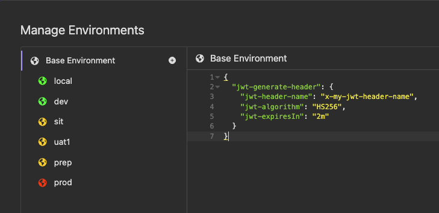
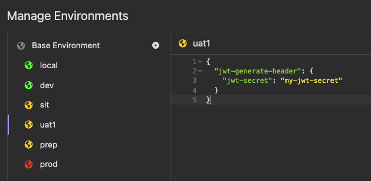
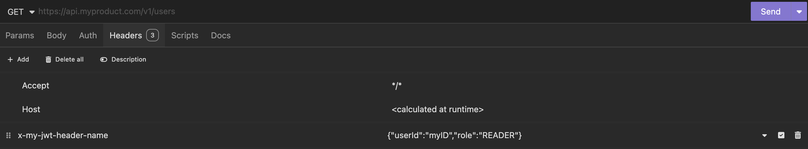
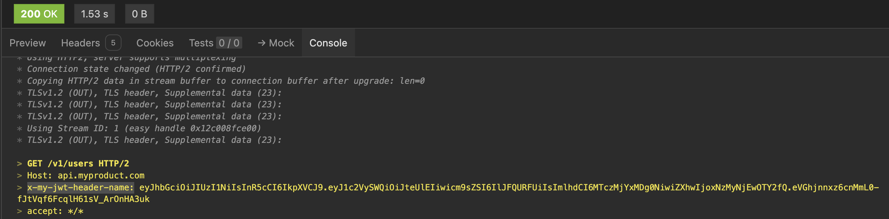

# Insomnia JWT Generate Header Plugin

## Installation

### From the Insomnia App

1. Go to _Application_ > _Preferences_ **or** click the cog icon (⚙️)
2. Navigate to the _Plugins_ tab
3. Enter `insomnia-plugin-jwt-generate-header`
4. Click _Install_

### From Insomnia Plugin Hub

1. Navigate to https://insomnia.rest/plugins/insomnia-plugin-jwt-generate-header
2. Click _Install Plugin_
3. Click _Open_
4. Once opened, click _Install_

### Manual Install

1. Using a terminal, `cd` into your Insomnia plugins folder - [See Insomnia Docs](https://docs.insomnia.rest/insomnia/introduction-to-plugins)
2. Run `git clone https://github.com/csailly/insominia-plugin-jwt-generate-header`
3. `cd` into the `insominia-plugin-jwt-generate-header` folder
4. Run `npn install`

## Usage

1. Set the environment variables :

```json
{
  "jwt-generate-header": {
    "jwt-header-name": "x-my-jwt",
    "jwt-algorithm": "HS256",
    "jwt-expiresIn": "2m",
    "jwt-secret": "secret-xxxx"
  }
}
```





2. Add the payload in the header `jwt-generate-header-payload`



3. Result


